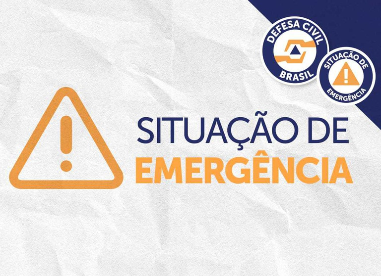

## Samu 192

---

##  Tela Inicial

**Botões:**
-  [Acionar Emergência 190](tel:190)
-  [Ver Passo a Passo de Salvamento](#passo-a-passo-de-salvamento)
-  [Acessar Kit de Primeiros Socorros](#kit-de-primeiros-socorros)

---

##  Tela de Emergência

**Você está em uma emergência?**

-  [Ligar para SAMU 190](tel:190)
-  [Compartilhar localização com socorristas](#tela-de-localizacao)
-  Tempo estimado para chegada: **8 minutos**

---

##  Passo a Passo de Salvamento

### 1. Identifique a Emergência

- Verifique se há risco de vida (queda, ferimento grave, parada cardíaca, etc).
- Mantenha a calma e avalie o ambiente.

### 2. Ligue para o SAMU 190

- Informe com clareza:
  - Local exato da ocorrência
  - Tipo de emergência
  - Estado da vítima
  - Seu nome e telefone
  

### 3. Preste Primeiros Cuidados
- Se tiver treinamento, aplique primeiros socorros.
- Não mova a vítima sem necessidade.
- Mantenha-a calma e segura.

### 4. Aguarde a Equipe

- Mantenha o local acessível.
- Afaste curiosos e sinalize a área.

### 5. Apoie o Atendimento

- Forneça informações adicionais.
- Siga as instruções dos socorristas.
- Registre os dados do atendimento.

---

##  Kit de Primeiros Socorros

**Itens essenciais:**
- Luvas descartáveis
- Gaze e esparadrapo
- Tesoura e pinça
- Antisséptico
- Termômetro

**Botões:**
- 📘 [Como usar cada item](#instrucoes-de-uso)
- 🎥 [Ver vídeos de instrução](#videos-de-socorro)

---

> ⚠️ **Importante:** Use o app com responsabilidade. Em caso de emergência, acione o SAMU 190 imediatamente.
